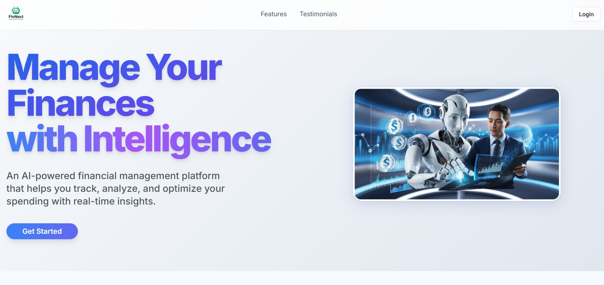

# 💸 Full Stack AI Finance Platform

Built using **Next.js**, **Supabase**, **TailwindCSS**, **Prisma**, **Inngest**, **ArcJet**, and **Shadcn UI**.





---

## 📦 Features

- ✅ Modern UI with Shadcn components & TailwindCSS
- 🔐 Clerk Authentication (Sign in, Sign up, Onboarding)
- 🧾 AI-Powered Receipt Scanning (Gemini API)
- 📬 Email integration via Resend
- 🧠 Background jobs with Inngest
- 🚀 Optimized performance with ArcJet
- 🗃️ PostgreSQL (via Supabase) using Prisma ORM

---

## ⚙️ Environment Variables

Create a `.env` file in the root directory and fill in your credentials:

```env
DATABASE_URL=
DIRECT_URL=

NEXT_PUBLIC_CLERK_PUBLISHABLE_KEY=
CLERK_SECRET_KEY=
NEXT_PUBLIC_CLERK_SIGN_IN_URL=/sign-in
NEXT_PUBLIC_CLERK_SIGN_UP_URL=/sign-up
NEXT_PUBLIC_CLERK_AFTER_SIGN_IN_URL=/onboarding
NEXT_PUBLIC_CLERK_AFTER_SIGN_UP_URL=/onboarding

GEMINI_API_KEY=

RESEND_API_KEY=

ARCJET_KEY=
```

---

## 🛠️ Getting Started

1. **Clone the Repository**

```bash
git clone https://github.com/Utkarsh-Singh3009/FinNext.git
cd FinNext
```

2. **Install Dependencies**

```bash
npm install
```

3. **Set Up Database**

```bash
npx prisma migrate dev
```

4. **Run the App**

```bash
npm run dev
```

---

## 📁 Tech Stack

| Tech         | Role                         |
|--------------|------------------------------|
| Next.js      | Frontend Framework (App Router) |
| Supabase     | PostgreSQL Database + Auth   |
| Prisma       | ORM for DB interaction       |
| TailwindCSS  | Styling                      |
| Clerk        | Authentication               |
| Inngest      | Background jobs              |
| Gemini API   | AI Receipt Scanner           |
| Resend       | Email Service                |
| ArcJet       | Edge Optimization            |

---

## 📬 Contact

Made with 💻 by [Utkarsh Singh](https://github.com/Utkarsh-Singh3009)

---
